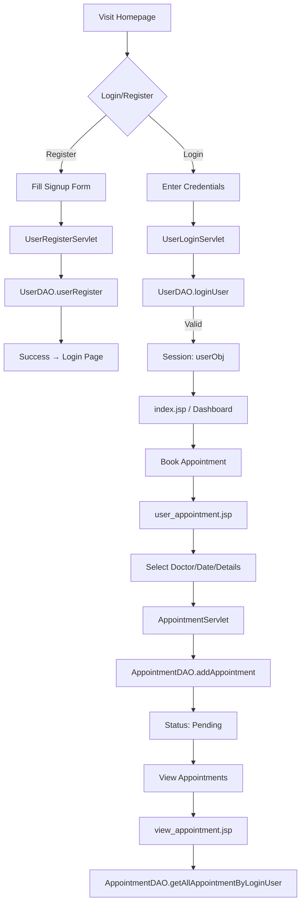
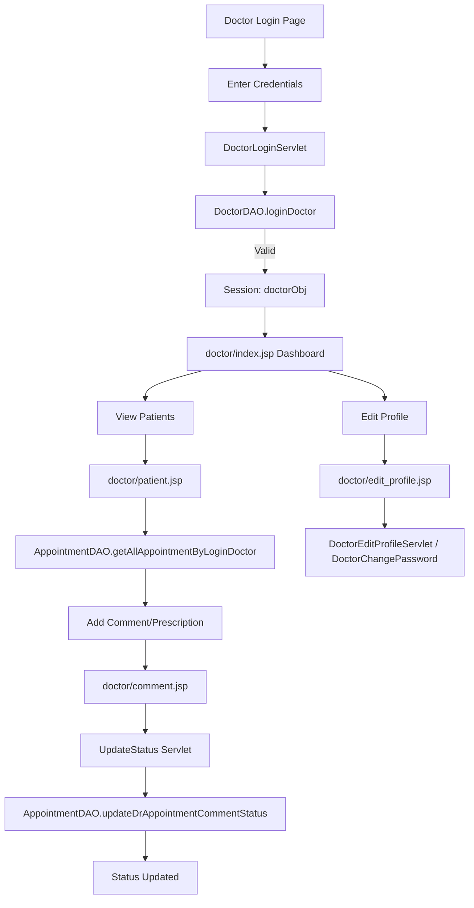
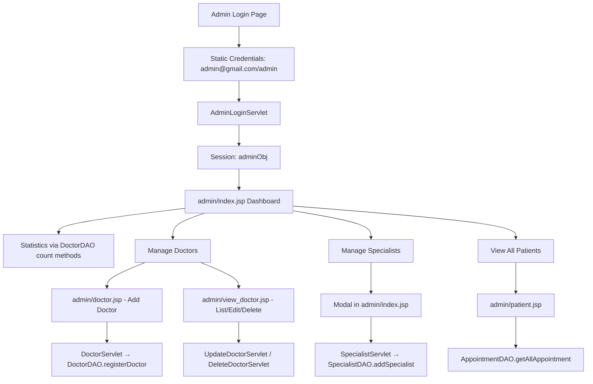

# Doctor-Patient Portal - Architecture Documentation

## 1. Executive Summary

The **Doctor-Patient Portal** is a Hospital Management System (HMS) web application built using Java Servlets, JSP, JSTL, and MySQL. It provides a comprehensive platform for managing hospital operations with three distinct user roles: **Admin**, **Doctor**, and **Patient/User**. The application follows a traditional Model-View-Controller (MVC) architecture pattern with JSP pages serving as the view layer, Servlets as controllers, and DAO classes handling data persistence.

**Key Capabilities:**
- User/Patient registration, authentication, and appointment booking
- Doctor management (registration, profile, appointments, prescriptions)
- Admin dashboard with statistics and doctor/specialist management
- Role-based access control with session management
- Real-time appointment status tracking and doctor comments/prescriptions

---

## 2. Functional Overview

### 2.1 Business Domain
The application operates in the **healthcare/hospital management domain**, facilitating the complete lifecycle of patient-doctor interactions from appointment booking to treatment documentation.

### 2.2 Major Functional Areas

| Functional Area | Description | Primary Actors |
|----------------|-------------|----------------|
| **User/Patient Management** | Registration, login, profile, password change, appointment booking/history | Patient/User |
| **Doctor Management** | Registration (by admin), login, profile editing, patient list, prescription/comments | Doctor, Admin |
| **Appointment Management** | Booking, viewing, status tracking (Pending → Comment/Prescription) | Patient, Doctor, Admin |
| **Admin Dashboard** | System statistics, doctor CRUD, specialist management | Admin |
| **Authentication & Authorization** | Role-based login, session management, access control | All roles |

### 2.3 User Roles & Permissions

| Role | Access Level | Key Capabilities |
|------|--------------|------------------|
| **Admin** | Full system access | Doctor CRUD, specialist management, view all appointments/patients, system statistics |
| **Doctor** | Own data + assigned patients | Profile management, patient list, add prescriptions/comments to appointments |
| **Patient/User** | Own data only | Register, book appointments, view own appointment history, change password |

---

## 3. High-Level Functional Flows

### 3.1 Patient/User Journey



### 3.2 Doctor Journey



### 3.3 Admin Journey



---

## 4. Business Rules and Validations

### 4.1 Authentication Rules
- **Admin**: Hardcoded credentials (`admin@gmail.com` / `admin`) - no database lookup
- **Doctor**: Email/password validated against `doctor` table
- **User**: Email/password validated against `user_details` table
- **Session-based authorization**: Each role checks for specific session attribute (`adminObj`, `doctorObj`, `userObj`)

### 4.2 Appointment Workflow
- **Status Values**: `Pending` (initial) → Doctor comment/prescription (final)
- **Patient** can only book appointments (status = "Pending")
- **Doctor** can add comments/prescriptions only to "Pending" appointments assigned to them
- **Admin** can view all appointments with full details

### 4.3 Data Validation Rules
| Entity | Validation Rules |
|--------|-----------------|
| **User** | Full name, email (unique), password required |
| **Doctor** | Full name, DOB, qualification, specialist, email, phone, password required |
| **Appointment** | All fields required: userId, fullName, gender, age, date, email, phone, diseases, doctorId, address |
| **Specialist** | Name required |

### 4.4 Business Constraints
- Email uniqueness enforced at database level (not explicitly checked in code)
- Doctor specialist must exist in `specialist` table (referential integrity via dropdown)
- Passwords stored in plaintext (security concern)
- No password complexity requirements
- No appointment conflict checking (double-booking possible)

---

## 5. Technical Architecture

### 5.1 Architecture Pattern
**Traditional Java EE MVC (Model 2 Architecture)**
- **Model**: Entity classes (`User`, `Doctor`, `Appointment`, `Specialist`) + DAO classes
- **View**: JSP pages with JSTL, EL, and embedded Java scriptlets
- **Controller**: `@WebServlet` annotated servlets handling HTTP requests

### 5.2 Technology Stack

| Layer | Technologies |
|-------|-------------|
| **Presentation** | JSP 2.x, JSTL 1.2, EL 3.0, Bootstrap 5, Font Awesome 6 |
| **Controller** | Servlet 4.0 (javax.servlet-api), Annotation-based mapping |
| **Business Logic** | Embedded in Servlets (no separate service layer) |
| **Data Access** | DAO pattern with JDBC, PreparedStatement |
| **Database** | MySQL 8.0 (jdbc:mysql://localhost:3306/hospital) |
| **Build** | Maven (war packaging) |
| **Connection Management** | Static singleton `DBConnection.getConn()` |

### 5.3 Request Handling Flow

```
HTTP Request
    ↓
Servlet Container (Tomcat/Jetty)
    ↓
@WebServlet URL Mapping
    ↓
Servlet.doGet/doPost()
    ↓
Extract Parameters (req.getParameter)
    ↓
Create Entity Objects
    ↓
DAO Operations (CRUD)
    ↓
DBConnection.getConn() → MySQL
    ↓
ResultSet → Entity Mapping
    ↓
Session Attributes (successMsg/errorMsg/data)
    ↓
resp.sendRedirect() or RequestDispatcher.forward()
    ↓
JSP Rendering (with JSTL/EL/Scriptlets)
    ↓
HTTP Response
```

---

## 6. Component Details

### 6.1 Controller Layer - Servlets

#### User Module (`com.hms.user.servlet`)
| Servlet | URL Pattern | Method | Purpose |
|---------|-------------|--------|---------|
| `UserLoginServlet` | `/userLogin` | POST | Authenticate user, create session |
| `UserRegisterServlet` | `/user_register` | POST | Register new user |
| `UserLogoutServlet` | `/userLogout` | GET | Invalidate session |
| `AppointmentServlet` | `/addAppointment` | POST | Create appointment |
| `ChangePasswordServlet` | `/userChangePassword` | POST | Change password with old password verification |
| `MyNewServlet` | `/MyNewServletRegisterUser` | GET/POST | Legacy/unused servlet |
| `myuserServlet` | `/myuserServlet` | - | Legacy/unused servlet (web.xml) |

#### Doctor Module (`com.hms.doctor.servlet`)
| Servlet | URL Pattern | Method | Purpose |
|---------|-------------|--------|---------|
| `DoctorLoginServlet` | `/doctorLogin` | POST | Authenticate doctor |
| `DoctorLogoutServlet` | `/doctorLogout` | GET | Invalidate session |
| `DoctorEditProfileServlet` | `/doctorEditProfile` | POST | Update doctor profile (no password) |
| `DoctorChangePassword` | `/doctorChangePassword` | POST | Change password with verification |
| `UpdateStatus` | `/updateStatus` | POST | Add comment/prescription to appointment |

#### Admin Module (`com.hms.admin.servlet`)
| Servlet | URL Pattern | Method | Purpose |
|---------|-------------|--------|---------|
| `AdminLoginServlet` | `/adminLogin` | POST | Static credential validation |
| `AdminLogoutServlet` | `/adminLogout` | GET | Invalidate session |
| `DoctorServlet` | `/addDoctor` | POST | Register new doctor |
| `UpdateDoctorServlet` | `/updateDoctor` | POST | Update doctor details |
| `DeleteDoctorServlet` | `/deleteDoctor` | GET | Delete doctor by ID |
| `SpecialistServlet` | `/addSpecialist` | POST | Add new specialist |

### 6.2 Data Access Layer - DAO Classes

| DAO | Entity | Key Methods |
|-----|--------|-------------|
| `UserDAO` | User | `userRegister()`, `loginUser()`, `checkOldPassword()`, `changePassword()` |
| `DoctorDAO` | Doctor | `registerDoctor()`, `getAllDoctor()`, `getDoctorById()`, `updateDoctor()`, `deleteDoctorById()`, `loginDoctor()`, `checkOldPassword()`, `changePassword()`, `editDoctorProfile()`, `countTotalDoctor()`, `countTotalAppointment()`, `countTotalAppointmentByDoctorId()`, `countTotalUser()`, `countTotalSpecialist()` |
| `AppointmentDAO` | Appointment | `addAppointment()`, `getAllAppointmentByLoginUser()`, `getAllAppointmentByLoginDoctor()`, `getAppointmentById()`, `updateDrAppointmentCommentStatus()`, `getAllAppointment()` |
| `SpecialistDAO` | Specialist | `addSpecialist()`, `getAllSpecialist()` |

### 6.3 Model Layer - Entity Classes

| Entity | Table | Fields |
|--------|-------|--------|
| `User` | `user_details` | id, fullName, email, password |
| `Doctor` | `doctor` | id, fullName, dateOfBirth, qualification, specialist, email, phone, password |
| `Appointment` | `appointment` | id, userId, fullName, gender, age, appointmentDate, email, phone, diseases, doctorId, address, status |
| `Specialist` | `specialist` | id, specialistName |

### 6.4 View Layer - JSP Pages

#### Public Pages
- `index.jsp` - Homepage with carousel, features, team
- `user_login.jsp` - User login form
- `signup.jsp` - User registration form
- `doctor_login.jsp` - Doctor login form
- `admin_login.jsp` - Admin login form

#### User/Patient Pages (require `userObj` session)
- `user_appointment.jsp` - Book new appointment (dynamic doctor dropdown)
- `view_appointment.jsp` - View own appointment history with status
- `change_password.jsp` - Change password

#### Doctor Pages (require `doctorObj` session)
- `doctor/index.jsp` - Dashboard with stats
- `doctor/patient.jsp` - List assigned patients/appointments
- `doctor/comment.jsp` - Add prescription/comment to pending appointment
- `doctor/edit_profile.jsp` - Edit profile & change password

#### Admin Pages (require `adminObj` session)
- `admin/index.jsp` - Dashboard with statistics (doctor, user, appointment, specialist counts)
- `admin/doctor.jsp` - Add new doctor form
- `admin/view_doctor.jsp` - List all doctors with edit/delete actions
- `admin/edit_doctor.jsp` - Edit doctor details
- `admin/patient.jsp` - View all patient appointments

#### Shared Components
- `component/navbar.jsp` - Dynamic navbar based on user session
- `component/admin/navbar.jsp` - Admin-specific navbar
- `component/doctor/navbar.jsp` - Doctor-specific navbar
- `component/footer.jsp` - Footer with social links
- `component/allcss.jsp` - Bootstrap, FontAwesome, custom CSS

---

## 7. Data Model

### 7.1 Database Schema (Inferred from Code)

```sql
-- User/Patient table
CREATE TABLE user_details (
    id INT PRIMARY KEY AUTO_INCREMENT,
    full_name VARCHAR(255),
    email VARCHAR(255) UNIQUE,
    password VARCHAR(255)
);

-- Doctor table
CREATE TABLE doctor (
    id INT PRIMARY KEY AUTO_INCREMENT,
    fullName VARCHAR(255),
    dateOfBirth DATE,
    qualification VARCHAR(255),
    specialist VARCHAR(255),  -- References specialist.specialist_name
    email VARCHAR(255) UNIQUE,
    phone VARCHAR(20),
    password VARCHAR(255)
);

-- Specialist table
CREATE TABLE specialist (
    id INT PRIMARY KEY AUTO_INCREMENT,
    specialist_name VARCHAR(255) UNIQUE
);

-- Appointment table
CREATE TABLE appointment (
    id INT PRIMARY KEY AUTO_INCREMENT,
    userId INT,
    fullName VARCHAR(255),
    gender VARCHAR(10),
    age VARCHAR(10),
    appointmentDate DATE,
    email VARCHAR(255),
    phone VARCHAR(20),
    diseases TEXT,
    doctorId INT,
    address TEXT,
    status VARCHAR(50) DEFAULT 'Pending',
    FOREIGN KEY (userId) REFERENCES user_details(id),
    FOREIGN KEY (doctorId) REFERENCES doctor(id)
);
```

### 7.2 Entity Relationships

```
User (1) ───< (N) Appointment
Doctor (1) ───< (N) Appointment
Specialist (1) ───< (N) Doctor [via specialist name]
```

---

## 8. Integration Points

### 8.1 External Dependencies
- **MySQL Database**: Primary data store (localhost:3306/hospital)
- **CDN Resources**: Bootstrap 5.0.2, Font Awesome 6.2.1 & 4.7.0 (via cdn.jsdelivr.net, cdnjs.cloudflare.com)

### 8.2 Internal Integration Patterns
- **Session-based State**: HttpSession for authentication and flash messages
- **Request Parameters**: Form data binding via `req.getParameter()`
- **JSP Includes**: `<%@include file="..."%>` for reusable components
- **Scriptlet DAO Access**: Direct DAO instantiation in JSPs (e.g., `user_appointment.jsp`, `view_appointment.jsp`)

### 8.3 Configuration
- **web.xml**: Legacy servlet registration for `myuserServlet` and `MyNewServlet`
- **Annotations**: `@WebServlet` for all modern servlets
- **Maven**: Dependency management (servlet-api, JSTL, MySQL connector, EL API)
- **DB Connection**: Hardcoded in `DBConnection.java` (root/wasim)

---

## 9. Key Architectural Decisions & Patterns

### 9.1 Design Patterns Used
1. **DAO Pattern**: Separates data access logic from business logic
2. **Front Controller (Partial)**: Each servlet handles specific operations
3. **Model 2 MVC**: JSP for view, Servlet for control, JavaBeans for model
4. **Session Facade**: Session attributes for auth state and flash messages

### 9.2 Notable Anti-Patterns / Technical Debt
1. **Scriptlets in JSPs**: Business logic and DAO calls embedded in view (`user_appointment.jsp`, `view_appointment.jsp`, admin/doctor JSPs)
2. **Static DB Connection**: Singleton `DBConnection.getConn()` - not thread-safe, no connection pooling
3. **Plaintext Passwords**: No hashing/encryption
4. **No Service Layer**: Business logic directly in servlets
5. **Hardcoded Admin**: Static credentials in `AdminLoginServlet`
6. **Mixed URL Patterns**: Some servlets in web.xml, most via annotations
7. **No Input Sanitization**: Direct parameter use in SQL (PreparedStatement prevents injection but no validation)
8. **No Transaction Management**: Auto-commit mode
9. **Duplicate Count Logic**: DoctorDAO has count methods for all entities (violates SRP)

### 9.3 Security Considerations
- **SQL Injection**: Prevented via PreparedStatement
- **XSS**: Partial protection via JSTL `${}` escaping, but scriptlets output raw values
- **CSRF**: No protection
- **Session Fixation**: No regeneration on login
- **Password Storage**: Plaintext - critical vulnerability

---

## 10. Deployment & Build

### 10.1 Build Configuration
```xml
<!-- pom.xml highlights -->
<packaging>war</packaging>
<dependencies>
    <dependency>javax.servlet:javax.servlet-api:4.0.1</dependency>
    <dependency>mysql:mysql-connector-java:8.0.28</dependency>
    <dependency>javax.servlet:jstl:1.2</dependency>
    <dependency>javax.el:javax.el-api:3.0.0</dependency>
</dependencies>
<build>
    <plugins>
        <plugin>org.apache.maven.plugins:maven-war-plugin:3.3.1</plugin>
    </plugins>
</build>
```

### 10.2 Deployment Requirements
- Servlet 4.0+ container (Tomcat 9+, Jetty 9+)
- MySQL 8.0+ database named `hospital`
- JDK 8+ (implied by servlet-api 4.0.1)

---

## 11. Summary

The Doctor-Patient Portal is a functional but legacy-style Java web application demonstrating core hospital management workflows. While it successfully implements role-based access, appointment management, and basic CRUD operations, it exhibits several architectural limitations typical of early 2000s Java EE applications: scriptlet-heavy views, no service layer, static database connections, and minimal security practices. The codebase provides a solid foundation for modernization to a contemporary architecture with separated frontend/backend, proper security, and scalable patterns.