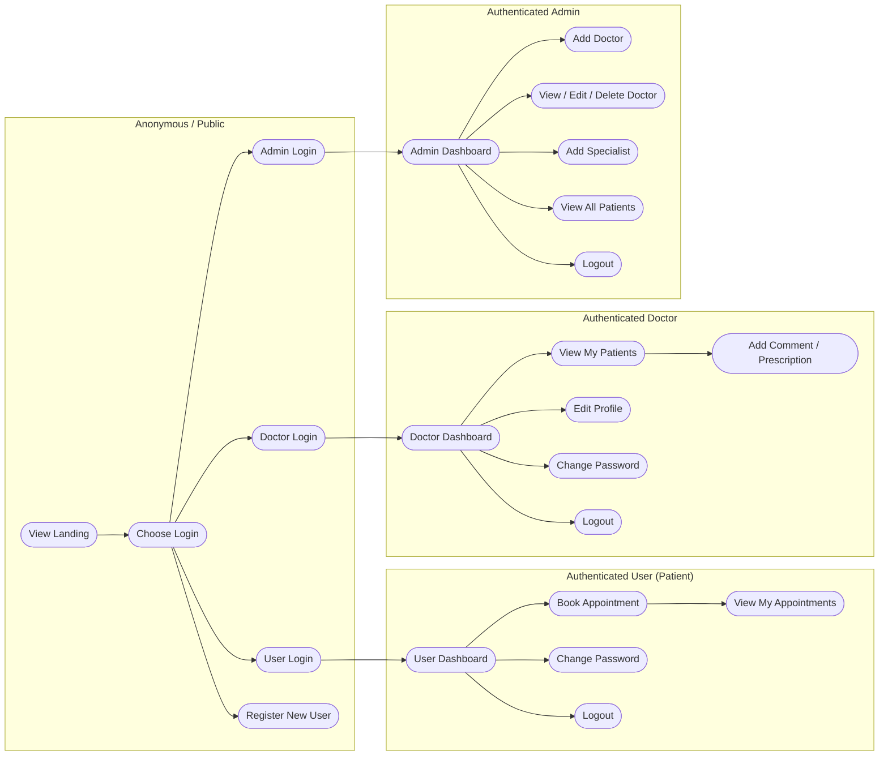

# Doctor-Patient Portal — Architecture & Functional Documentation

> **Note on framework:** The source tree does **not** depend on Apache Struts. There is no `struts-config.xml`, no `Action`/`ActionForm`/`ActionServlet`, and the `pom.xml` declares only `javax.servlet-api`, `jstl`, `javax.el-api`, and `mysql-connector-java`. The application implements the *same* request-driven MVC shape that Struts popularised — but by hand, using the raw Servlet API (`HttpServlet` + `@WebServlet`) as controllers, JSP + JSTL/EL as the view layer, and a hand-written DAO layer over JDBC as the model. Everything in the "Struts mapping" sections below is expressed as the **Servlet/JSP equivalent** (Servlet = Action, HTML `<form>` = Form bean, `sendRedirect`/`forward` = Forward).

---

## 1. Executive Summary

The **Doctor-Patient Portal** (`com.hms`, artifact `Doctor-Patient-Portal`) is a Java web application that manages the end-to-end workflow of a medical practice: public landing pages, **patient (user) self-service** (registration, login, appointment booking and tracking), a **doctor portal** (login, patient list, treatment comments / prescriptions, profile management), and an **admin console** (doctor & specialist management, global patient/appointment overview).

The application is built as a single WAR (`packaging=war`) and is architecturally a **three-role, server-rendered MVC** application. It is assembled with Maven, renders server-side HTML with JSP + Bootstrap 5, and persists state to a local MySQL database (`hospital`) via plain JDBC. Authentication is session-based with per-role session attributes (`userObj`, `doctorObj`, `adminObj`).

**Key characteristics**

| Aspect | Value |
|---|---|
| Build tool | Maven (war) |
| Servlet container target | Servlet API 4.0.1 (Tomcat 9+ implied) |
| View technology | JSP 3.1 + JSTL 1.2 + EL |
| Styling / JS | Bootstrap 5.0.2 + Font Awesome (CDN) |
| Data layer | JDBC `PreparedStatement` over MySQL (`mysql-connector-java` 8.0.28) |
| Security model | Session-scoped, role-gated (Admin / Doctor / User) |
| Business logic location | Embedded in DAO + controller (no separate service layer) |

---

## 2. Functional Overview

### 2.1 Business Domain

The domain is a **hospital appointment & records system** with three actor personas:

1. **Administrator** — a single, statically-configured superuser who onboards medical staff (doctors, specialties) and monitors the practice.
2. **Doctor** — a registered clinician who reviews patients assigned to them, records treatment comments / prescriptions against appointments, and maintains their own profile.
3. **User / Patient** — an end-user who self-registers, books appointments against a doctor, and views their own appointment history and status.

### 2.2 Major Functional Areas

| Functional Area | Capability | Primary Entry Point |
|---|---|---|
| **Public Site** | Landing page, login/register navigation | `index.jsp` |
| **User Self-Service** | Register, login, logout, book appointment, view own appointments, change password | `signup.jsp`, `user_login.jsp`, `user_appointment.jsp`, `view_appointment.jsp`, `change_password.jsp` |
| **Doctor Portal** | Login, logout, view assigned patients, add treatment comment/prescription, edit profile, change password | `doctor_login.jsp`, `doctor/index.jsp`, `doctor/patient.jsp`, `doctor/comment.jsp`, `doctor/edit_profile.jsp` |
| **Admin Console** | Login, logout, dashboard metrics, add/edit/delete doctors, add specialists, view all patients/appointments | `admin_login.jsp`, `admin/index.jsp`, `admin/doctor.jsp`, `admin/edit_doctor.jsp`, `admin/view_doctor.jsp`, `admin/patient.jsp` |

### 2.3 Business Entities & Domain Concepts

- **User** — a registered patient/customer (`user_details` table). Owns appointments.
- **Doctor** — a clinician (`doctor` table). Belongs to a **Specialist** category; owns appointments.
- **Specialist** — a medical speciality category (e.g. Cardiology) used to classify doctors.
- **Appointment** — the central business object. Captures patient demographics, the chosen doctor, date, disease notes, address, and a **status** field that doubles as the doctor's treatment comment/prescription.
- **Session Principal** — not a DB entity, but the runtime concept of the logged-in identity, keyed by `userObj` / `doctorObj` / `adminObj` in the `HttpSession`.

---

## 3. High-Level Functional Flows (User Journeys)



### 3.1 Journey: Patient registers & books an appointment

```
1. visitor  -->  GET  index.jsp                          (landing, public navbar)
2. visitor  -->  GET  signup.jsp                         (registration form)
3. visitor  -->  POST /user_register                     (UserRegisterServlet)
                --> UserDAO.userRegister(User)
                --> INSERT user_details
4. patient  -->  GET  user_login.jsp                     (login form)
5. patient  -->  POST /userLogin                         (UserLoginServlet)
                --> UserDAO.loginUser(email,password)
                --> sets session "userObj"
6. patient  -->  GET  user_appointment.jsp               (requires userObj)
                --> renders doctor <select> from DoctorDAO.getAllDoctor()
7. patient  -->  POST /addAppointment                    (AppointmentServlet)
                --> AppointmentDAO.addAppointment(...)    (status="Pending")
                --> INSERT appointment
8. patient  -->  GET  view_appointment.jsp               (requires userObj)
                --> AppointmentDAO.getAllAppointmentByLoginUser(userId)
                --> renders appointments; "Pending" badgeed amber
```

### 3.2 Journey: Doctor reviews a patient & posts a prescription

```
1. doctor  --> POST /doctorLogin                        (DoctorLoginServlet)
                --> DoctorDAO.loginDoctor(email,password)
                --> sets session "doctorObj"
2. doctor  --> GET  doctor/index.jsp                     (requires doctorObj)
                --> DoctorDAO.countTotalDoctor + countTotalAppointmentByDoctorId
3. doctor  --> GET  doctor/patient.jsp                   (requires doctorObj)
                --> AppointmentDAO.getAllAppointmentByLoginDoctor(doctorId)
                --> per row: "Pending" → Comment button; else disabled
4. doctor  --> GET  doctor/comment.jsp?id=<appt>          (requires doctorObj)
                --> AppointmentDAO.getAppointmentById(id)  (prefill read-only)
5. doctor  --> POST /updateStatus                        (UpdateStatus)
                --> AppointmentDAO.updateDrAppointmentCommentStatus(id, doctorId, comment)
                --> UPDATE appointment SET status=?      (status becomes the comment)
                --> redirect doctor/patient.jsp
```

### 3.3 Journey: Admin manages doctors & specialties

```
1. admin  -->  POST /adminLogin          (AdminLoginServlet, hardcoded admin@gmail.com/admin)
                --> sets session "adminObj"
2. admin  -->  GET  admin/index.jsp      (requires adminObj)
                --> counts doctors / users / appointments / specialists
3. admin  -->  POST /addSpecialist        (SpecialistServlet)        -> INSERT specialist
4. admin  -->  GET  admin/doctor.jsp     (add-doctor form)
5. admin  -->  POST /addDoctor           (DoctorServlet)            -> INSERT doctor
6. admin  -->  GET  admin/view_doctor.jsp(list, Edit | Delete links)
7. admin  -->  GET  admin/edit_doctor.jsp?id=<n>   (prefill from DoctorDAO.getDoctorById)
8. admin  -->  POST /updateDoctor        (UpdateDoctorServlet)      -> UPDATE doctor
9. admin  -->  GET  /deleteDoctor?id=<n> (DeleteDoctorServlet)      -> DELETE doctor
10. admin -->  GET  admin/patient.jsp    (all appointments + doctor name via join in JSP)
```

---

## 4. Business Rules and Validations

### 4.1 Authentication & Authorization (Roles)

| Role | Identity source | Session key | Access gate (JSP guard) |
|---|---|---|---|
| **Admin** | Hardcoded credential pair (`admin@gmail.com` / `admin`) | `adminObj` (a `User` placeholder) | `<c:if test="${empty adminObj}">` → `../admin_login.jsp` |
| **Doctor** | `DoctorDAO.loginDoctor(email,password)` against `doctor` table | `doctorObj` (`Doctor`) | `<c:if test="${empty doctorObj}">` → `../doctor_login.jsp` |
| **User** | `UserDAO.loginUser(email,password)` against `user_details` table | `userObj` (`User`) | `<c:if test="${empty userObj}">` → `user_login.jsp` |

- Guards are enforced **per-JSP** via JSTL `<c:if>` + `<c:redirect>`; there is **no servlet filter** for security. Any URL reachable by GET (e.g. `doctor/patient.jsp`) is protected only by the in-page guard.
- **No role hierarchy** — the three roles are mutually exclusive at the UI level (different navbars, different dashboards). There is no explicit server-side role-check enforcement on the servlets themselves; protection relies entirely on the JSP guards.

### 4.2 Input Validation Rules

Validation is **client-side only** (HTML5 attributes: `required`, `type="email"`, `type="number"`, `maxlength="11"` for phone). There is **no server-side validation** and **no Struts/Beans Validation** (`@NotNull`, etc.).

| Field | Constraint (HTML) | Server-side? |
|---|---|---|
| All form fields | `required` (where present) | ❌ none |
| email | `type="email"` | ❌ |
| age / phone | `type="number"` | ❌ |
| phone | `maxlength="11"` | ❌ (not enforced in DB either) |
| appointment date | `type="date"` (browser picker) | ❌ |
| gender | `<select>` only (male/female) | ❌ |
| doctor selection | required `<select>` | ❌ |

### 4.3 Business Logic & Calculations

- **Appointment status lifecycle**: A new appointment is always created with `status = "Pending"` (hardcoded in `AppointmentServlet`). The status is then **overwritten in place** by the doctor's free-text comment/prescription via `updateDrAppointmentCommentStatus(id, doctorId, comment)`. The same column carries both "Pending" sentinel value and the doctor's textual prescription — i.e. status *is* the comment.
  - `Pending` → displayed as an amber badge (`btn-warning`) in `view_appointment.jsp`.
  - Any other value → rendered as plain text (the doctor's comment).
  - In `doctor/patient.jsp`, a `Pending` appointment enables the "Comment / Prescription" action button; a non-Pending appointment renders the button **disabled**.
- **Doctor edit-profile** (`DoctorDAO.editDoctorProfile`) intentionally does **not** update the password column (the password setter/bind is commented out) — profile edits preserve the existing password.
- **Counts / dashboard metrics** are computed by iterating every row (`while(resultSet.next()) i++`) rather than `SELECT COUNT(*)` — inefficient but functionally correct.

### 4.4 Error Handling & Exception Scenarios

- All DAO methods swallow exceptions silently: `catch (Exception e) { e.printStackTrace(); }`. No propagation, no user-facing error codes.
- Servlets wrap request parsing in `try { ... } catch (Exception e) {}` in most cases, but several parse integers **without** a try/catch:
  - `ChangePasswordServlet` — `Integer.parseInt(req.getParameter("userId"))`
  - `AppointmentServlet` — `Integer.parseInt(req.getParameter("userId"))`, `Integer.parseInt(... "doctorNameSelect")`
  - `UpdateStatus` — `Integer.parseInt(... "id")`, `Integer.parseInt(... "doctorId")`
  - `DeleteDoctorServlet` — `Integer.parseInt(... "id")`
  - `UpdateDoctorServlet` — `Integer.parseInt(req.getParameter("id"))`
  - `DoctorEditProfileServlet` — `Integer.parseInt(req.getParameter("doctorId"))`
  - `doctor/comment.jsp` — `Integer.parseInt(request.getParameter("id"))`
  - These will throw `NumberFormatException` (→ HTTP 500) if the parameter is missing/non-numeric.
- `DBConnection.getConn()` returns a **single shared static `Connection`**; on failure it returns `null`, which would then cause an NPE inside a DAO — also swallowed into the boolean `false` return.
- Admin auth failure, doctor auth failure, and user auth failure all set `errorMsg` and redirect back to the login page (no account lockout, no rate limiting).

---

## 5. Technical Architecture

### 5.1 Layered Structure

```
+-----------------------------------------------------------+
|  PRESENTATION LAYER                                        |
|  JSP views + JSTL/EL + Bootstrap 5                         |
|  index, signup, *_login, user_*, doctor_*, admin_*         |
+-----------------------------------------------------------+
         | HTTP request (form post / query)  | HttpServletResponse redirect
+-----------------------------------------------------------+
|  CONTROL LAYER (Controller)                                |
|  HttpServlet subclasses (@WebServlet)                      |
|  user / doctor / admin servlet packages                    |
+-----------------------------------------------------------+
         | calls DAO methods, reads/writes HttpSession
+-----------------------------------------------------------+
|  BUSINESS / DATA-ACCESS LAYER                              |
|  DAO classes (UserDAO, DoctorDAO, AppointmentDAO,          |
|  SpecialistDAO) + DBConnection                             |
+-----------------------------------------------------------+
         | JDBC PreparedStatement
+-----------------------------------------------------------+
|  MODEL / DATA                                            |
|  Entity POJOs (User, Doctor, Appointment, Specialist)     |
|  + MySQL database "hospital"                              |
+-----------------------------------------------------------+
```

### 5.2 Struts-to-Servlet Equivalent Mapping

Because the project is Servlet-based, the requested Struts mapping is expressed as its direct equivalent:

| Struts concept | Actual implementation in this project |
|---|---|
| **Action** | `HttpServlet` subclass annotated `@WebServlet(url)` (e.g. `UserLoginServlet`) |
| **ActionForm** | The HTML `<form>`'s `<input name="...">` fields read via `req.getParameter(...)`; no typed form bean exists |
| **ActionMapping / forward** | `resp.sendRedirect("view.jsp")` (redirect) or implicit forward to the named JSP |
| **ActionServlet / RequestProcessor** | The Servlet container's built-in `HttpServlet` dispatcher; `@WebServlet` provides URL routing |
| **struts-config.xml** | Stays in `web.xml` + `@WebServlet` annotations (note: `web.xml` is partly stale — see §6.1) |
| **Form validation** | Browser HTML5 validation only; no `validation.xml` / `validation-rules.xml` equivalent |

### 5.3 Request Handling Pattern

The application follows a **Post-Redirect-Get (PRG)**:

1. A JSP renders a `<form action="<servletUrl>" method="post|get">`.
2. The matching `@WebServlet` parses parameters, invokes a DAO, sets a flash message (`successMsg` / `errorMsg`) on the session, and calls `resp.sendRedirect("targetView.jsp")`.
3. The target JSP reads the flash attribute via EL, renders it, immediately removes it with `<c:remove var="…" scope="session"/>`, then renders its body.
4. JSP `<%@include file="component/…"%>` performs static composition (navbar, css, footer) at compile time.

### 5.4 View Resolution Strategy

- Views are **static JSP files** addressed by relative path; the controller never performs a `RequestDispatcher.forward()`. Navigation is exclusively via `sendRedirect`.
- Component reuse is achieved with **static include** (`<%@include%>`) for `component/allcss.jsp`, `component/navbar.jsp`, `admin/navbar.jsp`, `doctor/navbar.jsp`, `component/footer.jsp`.
- Conditional rendering and iteration live inside **JSP scriptlets** (`<% %>`/`<%= %>`) and **JSTL** (`<c:if>`, `<c:remove>`, `<c:redirect>`). The code mixes scriptlets and JSTL heavily — a classic Struts-era anti-pattern where the view reaches directly into the DAO layer (e.g. `view_appointment.jsp` constructs `new DoctorDAO(DBConnection.getConn())` inline).

### 5.5 Data Access Pattern

- Pure **JDBC** with `PreparedStatement` (parameterised — SQL-injection-safe).
- A **single shared `java.sql.Connection`** is held as a `static` field in `DBConnection` and handed to every DAO. This is **not thread-safe** under concurrent load.
- **No connection pooling, no transaction manager, no ORM** (no Hibernate/JPA). Each HTTP request opens no new connection (it reuses the static one), and connections are never closed (`conn.close()` is never called) — a resource-leak risk in production.
- No separate service layer: business rules (counts, status lifecycle, password-change checks) live inside the DAO methods.

---

## 6. Component Details

### 6.1 Controller Inventory (Servlet = Action)

| Servlet | URL pattern | HTTP | Package | Responsibility |
|---|---|---|---|---|
| `UserRegisterServlet` | `/user_register` | POST | `user.servlet` | Register new user → `UserDAO.userRegister` |
| `MyNewServlet` | `/MyNewServletRegisterUser` | GET/POST | `user.servlet` | **Legacy/dead** — registered only in stale `web.xml`, not referenced by any JSP. `signup.jsp` posts to `/user_register` |
| `UserLoginServlet` | `/userLogin` | POST | `user.servlet` | User login → `UserDAO.loginUser` → set `userObj` |
| `UserLogoutServlet` | `/userLogout` | GET | `user.servlet` | Remove `userObj` |
| `ChangePasswordServlet` | `/userChangePassword` | POST | `user.servlet` | Verify old + set new password (`UserDAO`) |
| `AppointmentServlet` | `/addAppointment` | POST | `user.servlet` | Create appointment, status="Pending" |
| `DoctorLoginServlet` | `/doctorLogin` | POST | `doctor.servlet` | Doctor login → `DoctorDAO.loginDoctor` → set `doctorObj` |
| `DoctorLogoutServlet` | `/doctorLogout` | GET | `doctor.servlet` | Remove `doctorObj` |
| `DoctorEditProfileServlet` | `/doctorEditProfile` | POST | `doctor.servlet` | Update doctor profile (no password) |
| `DoctorChangePassword` | `/doctorChangePassword` | POST | `doctor.servlet` | Verify old + set new password (`DoctorDAO`) |
| `UpdateStatus` | `/updateStatus` | POST | `doctor.servlet` | Overwrite appointment status with doctor's comment |
| `AdminLoginServlet` | `/adminLogin` | POST | `admin.servlet` | Hardcoded admin check → set `adminObj` |
| `AdminLogoutServlet` | `/adminLogout` | GET | `admin.servlet` | Remove `adminObj` |
| `DoctorServlet` | `/addDoctor` | POST | `admin.servlet` | Register a doctor (`DoctorDAO.registerDoctor`) |
| `UpdateDoctorServlet` | `/updateDoctor` | POST | `admin.servlet` | Update doctor (`DoctorDAO.updateDoctor`) |
| `DeleteDoctorServlet` | `/deleteDoctor` | GET | `admin.servlet` | Delete doctor by id |
| `SpecialistServlet` | `/addSpecialist` | POST | `admin.servlet` | Add a specialist category (`SpecialistDAO.addSpecialist`) |

> **Stale `web.xml` finding:** `WEB-INF/web.xml` declares `myuserServlet` → `com.hms.user.servlet.myuserServlet` (class does not exist; casing differs from `MyNewServlet`) and `MyNewServlet` → `com.hms.user.servlet.MyNewServlet`. The real registration flow uses `UserRegisterServlet` via its `@WebServlet("/user_register")` annotation and `signup.jsp` posts to `user_register`. The `web.xml` is therefore out of sync with the running application and should be cleaned up.

### 6.2 Form / Input Inventory (ActionForm equivalent)

| Source JSP | Target URL | Notable form fields |
|---|---|---|
| `signup.jsp` | `/user_register` | `fullName`, `email`, `password` |
| `user_login.jsp` | `/userLogin` | `email`, `password` |
| `user_appointment.jsp` | `/addAppointment` | `userId`(hidden), `fullName`, `gender`, `age`, `appointmentDate`, `email`, `phone`, `diseases`, `doctorNameSelect`, `address` |
| `change_password.jsp` | `/userChangePassword` | `userId`(hidden), `newPassword`, `oldPassword` |
| `admin_login.jsp` | `/adminLogin` | `email`, `password` |
| `admin/doctor.jsp` | `/addDoctor` | `fullName`, `dateOfBirth`, `qualification`, `specialist`, `email`, `phone`, `password` |
| `admin/edit_doctor.jsp` | `/updateDoctor` | `fullName`, `dateOfBirth`, `qualification`, `specialist`, `email`, `phone`, `password`, `id` |
| `admin/index.jsp` (modal) | `/addSpecialist` | `specialistName` |
| `doctor_login.jsp` | `/doctorLogin` | `email`, `password` |
| `doctor/edit_profile.jsp` (change pw) | `/doctorChangePassword` | `doctorId`(hidden), `newPassword`, `oldPassword` |
| `doctor/edit_profile.jsp` (edit profile) | `/doctorEditProfile` | `fullName`, `dateOfBirth`, `qualification`, `specialist`, `email`(readonly), `phone`, `doctorId`(hidden) |
| `doctor/comment.jsp` | `/updateStatus` | `comment`, `id`(hidden), `doctorId`(hidden) |

### 6.3 Forward / Navigation Map (response targets)

- `UserRegisterServlet` → `signup.jsp` (success & error)
- `UserLoginServlet` → `index.jsp` (success) / `user_login.jsp` (failure)
- `UserLogoutServlet` → `user_login.jsp`
- `ChangePasswordServlet` → `change_password.jsp`
- `AppointmentServlet` → `user_appointment.jsp`
- `DoctorLoginServlet` → `doctor/index.jsp` (success) / `doctor_login.jsp` (failure)
- `DoctorLogoutServlet` → `doctor_login.jsp`
- `DoctorEditProfileServlet` → `doctor/edit_profile.jsp`
- `DoctorChangePassword` → `doctor/edit_profile.jsp`
- `UpdateStatus` → `doctor/patient.jsp`
- `AdminLoginServlet` → `admin/index.jsp` (success) / `admin_login.jsp` (failure)
- `AdminLogoutServlet` → `admin_login.jsp`
- `DoctorServlet` → `admin/doctor.jsp`
- `UpdateDoctorServlet` → `admin/view_doctor.jsp`
- `DeleteDoctorServlet` → `admin/view_doctor.jsp`
- `SpecialistServlet` → `admin/index.jsp`

### 6.4 View Inventory (JSP pages)

**Public / shared**
- `index.jsp` — home page: carousel, feature cards, team cards
- `component/navbar.jsp` — public+user navbar (role-conditional links)
- `component/allcss.jsp` — Bootstrap 5 + Font Awesome (CDN) + global CSS
- `component/footer.jsp`, `component/footersimple.jsp` — footers

**User flows**
- `signup.jsp`, `user_login.jsp`, `user_appointment.jsp`, `view_appointment.jsp`, `change_password.jsp`

**Doctor flows**
- `doctor_login.jsp`, `doctor/navbar.jsp`, `doctor/index.jsp`, `doctor/patient.jsp`, `doctor/comment.jsp`, `doctor/edit_profile.jsp`

**Admin flows**
- `admin/navbar.jsp`, `admin/index.jsp`, `admin/doctor.jsp`, `admin/edit_doctor.jsp`, `admin/view_doctor.jsp`, `admin/patient.jsp`

### 6.5 Business-Logic Integration Points

Business logic is **not** isolated behind a service facade; it is reached directly from the controllers:

- Controllers → `new UserDAO(DBConnection.getConn())` / `new DoctorDAO(...)` / `new AppointmentDAO(...)` / `new SpecialistDAO(...)`
- Some **JSPs also call the DAO layer directly** (scriptlets):
  - `view_appointment.jsp` — `AppointmentDAO`, `DoctorDAO`
  - `user_appointment.jsp` — `DoctorDAO.getAllDoctor()` (to populate the doctor `<select>`)
  - `admin/index.jsp` — `DoctorDAO` count methods
  - `admin/edit_doctor.jsp`, `admin/doctor.jsp` — `SpecialistDAO.getAllSpecialist()`
  - `doctor/index.jsp` — `DoctorDAO` counts
  - `doctor/patient.jsp`, `doctor/comment.jsp` — `AppointmentDAO`
  - `admin/patient.jsp`, `admin/view_doctor.jsp` — `AppointmentDAO`, `DoctorDAO`

This tightly couples the view to the data access layer — the single biggest modernization obstacle (see Part 3).

---

## 7. Data Model

### 7.1 Entity POJOs

| Entity | Package | Key fields | Notes |
|---|---|---|---|
| `User` | `com.hms.entity` | `id`, `fullName`, `email`, `password` | Patient/customer identity |
| `Doctor` | `com.hms.entity` | `id`, `fullName`, `dateOfBirth`, `qualification`, `specialist`, `email`, `phone`, `password` | Clinician; `specialist` is the name, not a FK to `specialist.id` |
| `Appointment` | `com.hms.entity` | `id`, `userId`, `fullName`, `gender`, `age`, `appointmentDate`, `email`, `phone`, `disease`s, `doctorId`, `address`, `status` | `status` holds both "Pending" sentinel and doctor's comment text |
| `Specialist` | `com.hms.entity` | `id`, `specialistName` | Medical category (e.g. Cardiology) |

### 7.2 Database Schema (inferred from DAO SQL)

| Table | Columns |
|---|---|
| `user_details` | `id` (PK), `full_name`, `email`, `password` |
| `doctor` | `id` (PK), `fullName`, `dateOfBirth`, `qualification`, `specialist`, `email`, `phone`, `password` |
| `specialist` | `id` (PK), `specialist_name` |
| `appointment` | `id` (PK), `userId`, `fullName`, `gender`, `age`, `appointmentDate`, `email`, `phone`, `diseases`, `doctorId`, `address`, `status` |

### 7.3 Entity Relationships

```
user_details      1 ──<  appointment >─── N  doctor
                                  |
                                  N  specialist (name stored, no FK)
```

- `appointment.userId` → `user_details.id`
- `appointment.doctorId` → `doctor.id`
- `appointment.status` is overloaded: `"Pending"` sentinel vs free-text doctor comment.
- `doctor.specialist` stores the **specialist name** (a denormalised string, not a foreign key to `specialist.id`). The `specialist` table exists to feed the admin "Add Doctor" dropdown only.

### 7.4 DAO Method Summary

**UserDAO** — `userRegister`, `loginUser(email,password)`, `checkOldPassword`, `changePassword`
**DoctorDAO** — `registerDoctor`, `getAllDoctor`, `getDoctorById`, `updateDoctor`, `deleteDoctorById`, `loginDoctor`, `countTotalDoctor`, `countTotalAppointment`, `countTotalAppointmentByDoctorId`, `countTotalUser`, `countTotalSpecialist`, `checkOldPassword`, `changePassword`, `editDoctorProfile`
**AppointmentDAO** — `addAppointment`, `getAllAppointmentByLoginUser`, `getAllAppointmentByLoginDoctor`, `getAppointmentById`, `updateDrAppointmentCommentStatus`, `getAllAppointment`
**SpecialistDAO** — `addSpecialist`, `getAllSpecialist`

---

## 8. Integration Points

| Integration | Endpoint / Resource | Notes |
|---|---|---|
| **Database** | MySQL 8, `jdbc:mysql://localhost:3306/hospital`, user `root`, pass `wasim` | Connection hardcoded in `DBConnection`; no pool, no externalised config |
| **Bootstrap** | `cdn.jsdelivr.net/npm/bootstrap@5.0.2` (CSS + JS bundle) | CDN dependency; offline use breaks styling |
| **Font Awesome** | `cdnjs.cloudflare.com/ajax/libs/font-awesome` (v6.2.1 + legacy 4.7.0) | Mixed FA versions (free-solid + classic) |
| **Java Servlet API** | `javax.servlet-api` 4.0.1 (provided scope) | Runs on any Servlet 4 container (Tomcat 9+, Jetty 10+, etc.) |
| **JSTL** | `javax.servlet.jsp.jstl` / `jstl` 1.2 | Tag library for view logic |
| **Build** | Maven (`maven-war-plugin` 3.3.1, final name `Doctor-Patient-Portal`) | Standard WAR, no external services |

### 8.1 External System Dependencies

- **MySQL database server** — the only true external system. The application will fail to render any data-dependent page if MySQL is unreachable (the static `Connection` becomes `null` and DAOs return empty/falsy results silently).
- **CDN availability** — Bootstrap and Font Awesome are loaded from CDNs. A network-restricted environment will lose all styling and iconography.
- No REST APIs, no message queues, no email/SMS services, no caching layer, no logging framework (only `e.printStackTrace()`).

---

## 9. Architectural Assessment (summary for modernization)

| Concern | Current state | Impact |
|---|---|---|
| **View technology** | JSP scriptlets + JSTL | High coupling; hard to unit-test; blocks SPA migration |
| **Controller** | HttpServlet (no framework) | Manual; no interceptors/filters for cross-cutting concerns |
| **Form validation** | HTML5 only | No server-side safety net |
| **Business logic location** | DAO + JSP scriptlets | Violates separation of concerns; no service layer |
| **Persistence** | Raw JDBC, single static Connection | Thread-safety & leak risks; no ORM, no pool |
| **Authentication** | Session + hardcoded admin; plaintext passwords | Security risk; no token/API support |
| **Authorization** | JSP-level guards only | No servlet filter; fragile |
| **Config** | Hardcoded DB URL/credentials in Java | Not portable; secrets in source |
| **web.xml** | Stale (references non-existent `myuserServlet`) | Misleading; should be cleaned or regenerated |
